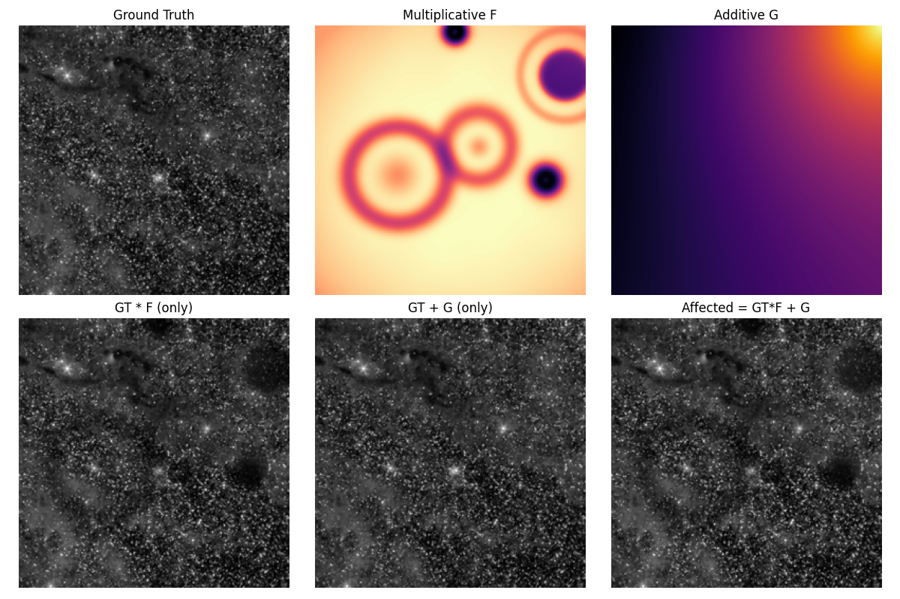

# FlatAI - AI-Powered Flat-Field Correction

**FlatAI** is a deep learning framework for correcting optical artifacts in astronomical images. It uses a physics-informed neural network to remove vignetting, dust motes, sensor non-uniformity (PRNU), and additive gradients from sources like amplifier glow, eliminating the need for traditional flat-field calibration frames.

This project has evolved to incorporate a sophisticated **hybrid data pipeline** and advanced training techniques to produce a state-of-the-art correction model that is robust, efficient, and less prone to common deep learning artifacts.



## The Physical Model of Image Degradation

The image formation process in the presence of flat-field artifacts can be described by the following equation:

$I_{observed} = (I_{true} \times F_{mult}) + G_{add}$

Where:
-   $I_{observed}$ is the final image captured by the sensor.
-   $I_{true}$ is the "perfect" image of the astronomical object.
-   $F_{mult}$ is the **multiplicative flat-field**, a 2D map representing artifacts like vignetting and dust motes.
-   $G_{add}$ is the **additive gradient field**, a 2D map representing artifacts like amplifier glow.

The network is designed to predict $F_{mult}$ and $G_{add}$ directly, allowing for a physically-motivated correction.

## Model Architecture: `AttentionResUNetFG`

The core of this project is the `AttentionResUNetFG`, a U-Net architecture enhanced with several key features:

1.  **Residual Blocks:** Facilitate the training of a deeper network and mitigate vanishing gradients.
2.  **Attention Gates:** Allow the model to selectively focus on the most relevant features from the encoder path, improving reconstruction accuracy.
3.  **Multi-Headed Output:** The network has three output heads, predicting:
    -   $F_{mul}$: The multiplicative field.
    -   $G_{add}$: The additive field.
    -   $M$: A **confidence map**, which prevents the model from altering parts of the image that are already clean.
4.  **Spatially-Aware Input:** The model receives four input channels: the affected image, two normalized coordinate channels (`xx`, `yy`), and a dynamically generated local noise map. This provides global spatial context and helps differentiate between signal, noise, and artifacts.

<details>
<summary>Click to expand a diagram of the model architecture</summary>

```mermaid
graph TD
    subgraph Input
        A[Image + Coords + Noise]
    end

    subgraph Encoder
        A --> B(enc1: ResBlock 4->64);
        B --> C{pool1: MaxPool2d};
        C --> D(enc2: ResBlock 64->128);
        D --> E{pool2: MaxPool2d};
        E --> F(enc3: ResBlock 128->256);
        F --> G{pool3: MaxPool2d};
        G --> H(enc4: ResBlock 256->512);
        H --> I{pool4: MaxPool2d};
    end

    subgraph Bottleneck
        I --> J(bottleneck: ResBlock 512->1024);
    end

    subgraph Decoder
        J --> K(up4: Upsample);
        K --> L(dec_conv4: ResBlock 1024->512);
        subgraph Skip Connection 4
            H --> M(att4: AttentionGate);
            L --> M;
        end
        M --> N(dec_combine4: ResBlock 1024->512);
        N --> O(up3: Upsample);
        O --> P(dec_conv3: ResBlock 512->256);
        subgraph Skip Connection 3
            F --> Q(att3: AttentionGate);
            P --> Q;
        end
        Q --> R(dec_combine3: ResBlock 512->256);
        R --> S(up2: Upsample);
        S --> T(dec_conv2: ResBlock 256->128);
        subgraph Skip Connection 2
            D --> U(att2: AttentionGate);
            T --> U;
        end
        U --> V(dec_combine2: ResBlock 256->128);
        V --> W(up1: Upsample);
        W --> X(dec_conv1: ResBlock 128->64);
        subgraph Skip Connection 1
            B --> Y(att1: AttentionGate);
            X --> Y;
        end
        Y --> Z(dec_combine1: ResBlock 128->64);
    end
    
    subgraph Output Heads
        Z --> AA(out_conv: Conv2d 64->3);
        AA --> BB[F_mul prediction];
        AA --> CC[G_add prediction];
        AA --> DD[M (confidence) prediction];
    end
```
</details>

## Hybrid Dataset Strategy

To ensure robust training and reliable validation, this project employs a hybrid dataset strategy:

1.  **Dynamic "On-the-Fly" Training Set:**
    The training data is generated in real-time. The `FlatFieldDataset` class loads a pre-processed sharp image and applies a unique, randomly generated set of artifacts to it for each training step. This creates a virtually infinite dataset, preventing overfitting and exposing the model to a vast range of conditions.

2.  **Static Validation Set:**
    The validation set is pre-generated and fixed. This ensures that the model's performance is evaluated against the same consistent data from epoch to epoch, providing a stable and reliable metric for tracking progress.

The `artifact_generator.py` script is central to this process, procedurally generating realistic artifacts:
-   **Multiplicative ($F_{mult}$):** Vignetting, complex dust motes (soft, hard, and donut-shaped), and PRNU noise.
-   **Additive ($G_{add}$):** Linear gradients and amplifier glow.

## Advanced Training Methodology

Several advanced techniques are used to ensure stable, efficient, and effective training:

-   **Variable-Size Image Training:** The model is not trained on fixed-size crops. Instead, a custom `collate_fn` dynamically pads images within each batch to match the largest image's dimensions. This forces the model to become size-agnostic and is critical for **preventing tiling artifacts** in the final corrected images.

-   **Aggressive Data Augmentation:** To further improve robustness, training samples are subjected to random horizontal flips, vertical flips, and 90-degree rotations. This ensures the model learns the underlying structure of artifacts, not their specific orientation or position.

-   **Gradient Accumulation:** To train with a large effective batch size on limited VRAM, gradients are accumulated over several smaller batches before an optimizer step is performed. This stabilizes the learning process without requiring a high-end GPU.

-   **Physics-Informed Loss:** The composite loss function combines standard pixel-wise and perceptual (LPIPS) losses with a **physics consistency loss**. This term ensures the predicted correction fields are physically plausible by feeding the corrected image back through the degradation model and comparing it to the original input.

## Usage

### 1. Setup
Clone the repository and install the required packages.

```bash
git clone https://github.com/your-username/FlatAI.git
cd FlatAI
pip install torch torchvision numpy astropy matplotlib tqdm lpips
```

### 2. Dataset Generation
1.  Place your high-quality, artifact-free astronomical images (FITS, PNG, or JPG) in the `sharp_images/` directory.
2.  Run the dataset generation script. This will pre-process the sharp images for the on-the-fly trainer and create the static validation set.
    ```bash
    python create_flat_dataset.py
    ```
    This will create the `randomized_flat_dataset/` directory.

### 3. Training
Start the training process. The script supports automatic resuming from checkpoints.

```bash
python train_unet_flat.py
```
Training samples and a loss curve will be saved to the `flat_training_samples/` directory.

### 4. Inference
Use the provided GUI to apply the trained model to new images.

```bash
python gui_corrector_final.py
```

## License
This project is licensed under the MIT License. See the `LICENSE` file for details.
